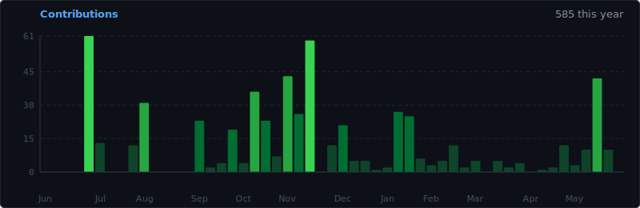

  <h1>Hi, I'm Nemesis Hubris</h1>
  
<strong>Biochemistry Student | Modder | Fedora User</strong>

  

---

### About Me

* **Kindle Jailbreaking:** I run **Kindlemodshelf.me** and host a collection of modding resources. I help people get their devices sorted.
* **Reverse Engineering:** I reverse engineer APIs, Chrome extensions, and closed software ecosystems. I also do security research on HackerOne.
* **OS & Hardware:** I run a home server and daily drive Fedora on my main machines (Linus Torvalds style).
* **Academics:** Currently earning a degree in biochemistry.
* **Tech Take:** Claude is the best. ChatGPT sucks.

---

### Activity & Stats

  

  

  

